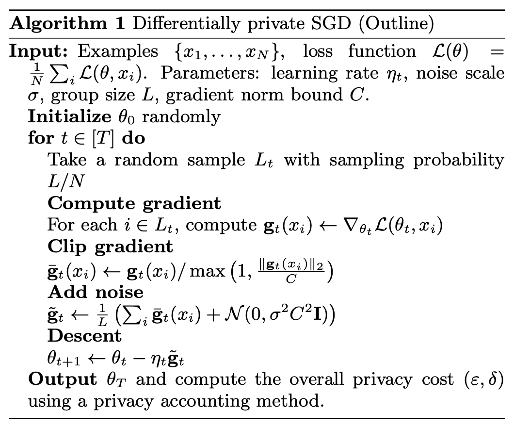

### Differentially Private Learning // Learning Differential Privacy
This is a repo to record my experiments in differentially private learning

Differential privacy is a mathematical definition of privacy that enables sharing of useful information from sensitive datasets. Differential privacy is a property of a mechanism or algorithm applied to a dataset, and not a property of the dataset itself (as is the case with techniques like anonymization).

Machine learning algorithms are routinely applied to sensitive data to provide useful results. There is incentive to make machine learning differentially private for a variety of purposes, such as automated loan decisions that use sensitive financial information for training. A commonly cited example of this is the recovery of training images from a facial recognition API [[Fredrikson et al. 2015]](https://www.cs.cmu.edu/~mfredrik/papers/fjr2015ccs.pdf).

Machine learning problems are widely solved using iterative optimization to minimize a loss function, and these iterative optimization methods can be made differentially private. In this repo, we implement differentially private stochastic gradient descent (DP-SGD) for optimization of the logistic regression algorithm. This algorithm (shown below) was first introduced by [Abadi et al. 2016](https://arxiv.org/pdf/1607.00133.pdf) in Deep Learning with Differential Privacy. The idea is to clip each gradient, which is a commonly used regularization technique, followed by Gaussian noise addition.

A key component of such algorithms is tracking privacy loss. Basic and advanced composition lead to a fast accumulation of privacy loss. Here, we incorporate information about the algorithm, such as, in each epoch, only a batch of data is used for training. Further, we use the moments accountant, where privacy loss is treated as a random variable and higher moments are used to obtain a tighter bound on privacy loss. Overall, given , the probability of failure of the differentially private mechanism, we can get an upper bound on the privacy loss, ,

Here, we implement the moments accountant, which allows a tighter bound on privacy loss by incorporating information about the algorithm (such as, in each epoch, only a batch of data is used for training).
